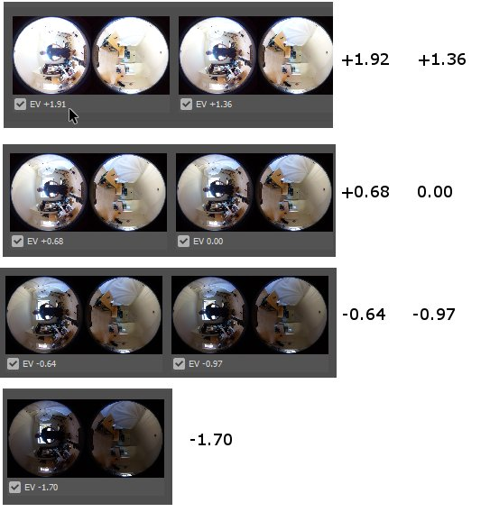
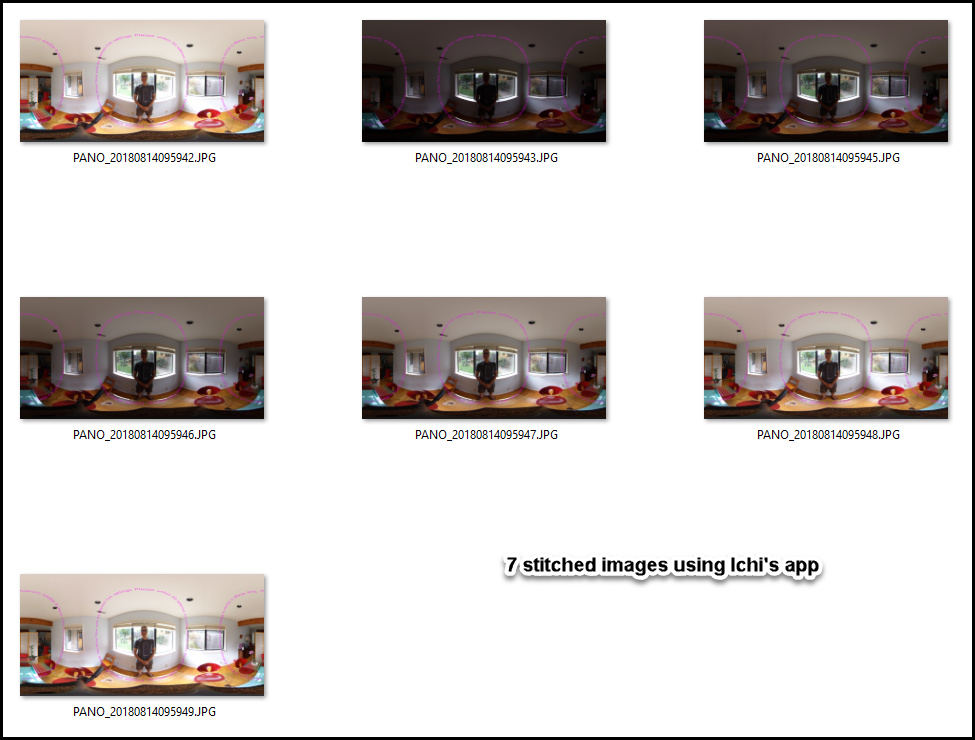

# 7 Image Bracket Dual-Fisheye Modification

Please see the master branch for more information.

## Features and Usage Information

- 7 image dual-fisheye taken within 7 seconds
- Each image takes approximately 1 second
- single image dual-fisheye in less than 1 second
- HDR blending is handled by a free third-party application called Picturenaut (see documentation for instructions)
- Dual-fisheye to equirectangular stitching is handled by Ichi Hirota's app. Demo version available in documentation.

## Post Processing

You need additional software to stitch the images to equirectangular.

## Alternate Versions

As the repository was prepared for a development workshop, there are examples to
extend the code for different purposes.

### 3 Image original

The original version in the master branch takes 3 images.

### Shutter Speed Modification

The [shutter-speed branch](https://github.com/codetricity/original-dual-fisheye-plugin/tree/shutter-speed) 
 of this repository has the following changes:

- expanded exposure range from 1/25000 to 60 second exposure time
- 12 image and 9 image bracket shooting 
- plug-in starts in bracket shooting mode by default instead of single-shot mode
- exposure is controlled by shutter speed instead of exposure compensation 

## Usage Notes

The plug-in is called *Plugin Application*

You must set permissions. Documentation includes information on using Vysor.

In single image mode, the Wi-Fi LED will be cyan.

In 3 image mode, the LED will be magenta.

Switch between the modes by briefly pressing the Wi-Fi button on the side
of the camera.

## Known Issues

As this is an example code base for learning purposes, there are a number of issues
that we are intentionally not fixing to keep the line count small and to illustrate
camera behavior, including when the plug-in crashes.  This example does not handle
long button presses. If you press the Wi-Fi, Mode, or Shutter buttons on the camera for
longer than 1 second, it will send a *long button press* instead of a normal button press. 
In many cases, the *long button press* will crash the plug-in. When using the plug-in, you should use
short button presses only. Press and release each button quickly.

- when going into plug-in mode, pressing the mode button for too long may crash the plug-in
- when taking a picture in plug-in mode, pressing the shutter button for too long may crash the plug-in
- when switching between single-shot and multi-picture mode in plug-in mode, you normally short-press the Wi-Fi button on the side of the camera. If you press this button for too long, it may crash the plug-in.

Discussion
https://community.theta360.guide/t/dual-fisheye-images-with-theta-v-plug-in/2692/