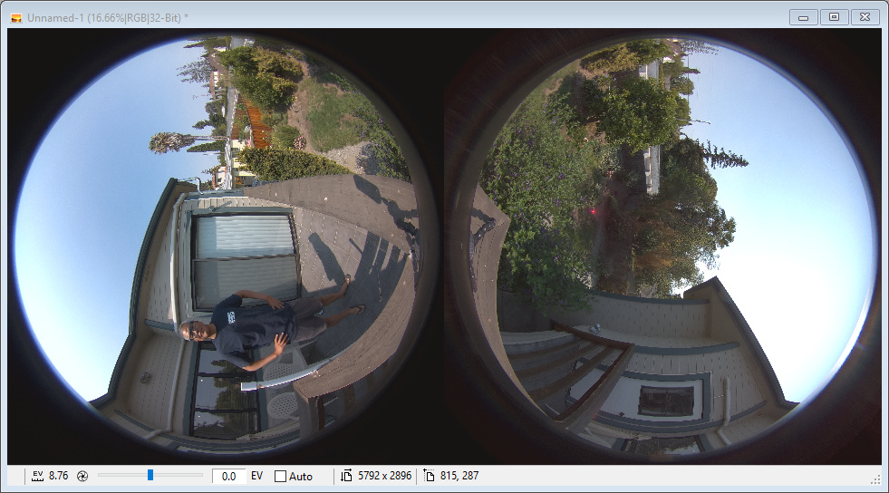
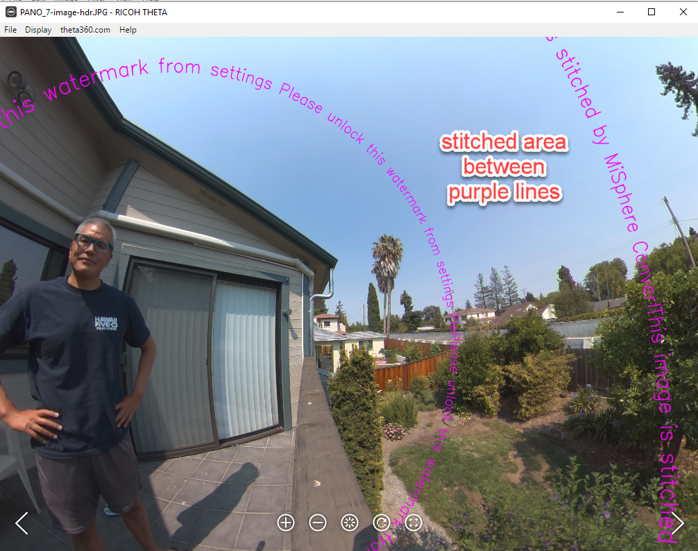
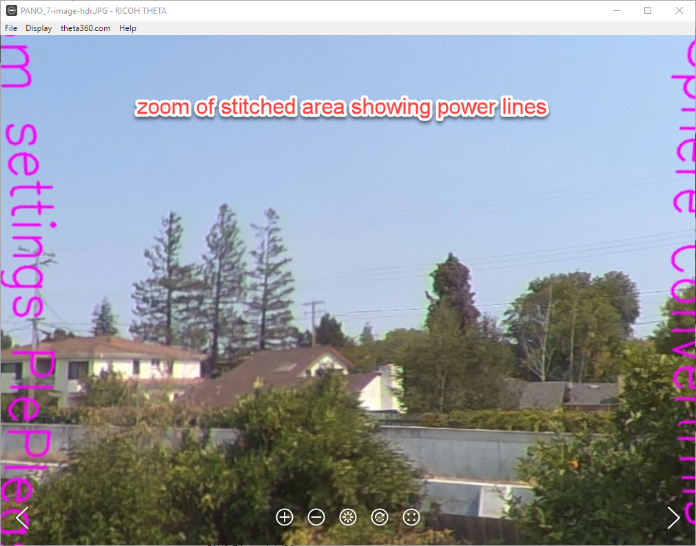

# Dual-Fisheye For THETA V

This is a early code for the Dual Fisheye Plug-in by Ichi Hirota for the RICOH THETA V.  This is not the same as the code for Ichi's plug-in that is in the plug-in store.

This repository was created for a technical workshop as part of educational curriculum. 

__This code is not intended for production use.__  

For more information on
plug-in development, including use and modification of this plug-in, see the free plug-in developer
guide, available at http://theta360.guide/plugin/

An improved version of [Ichi Hirota's app is available in the THETA Plug-in Store](https://pluginstore.theta360.com/plugins/com.hirota41.dualfisheye_plugin/).

## Features and Usage Information

- 3 image dual-fisheye taken within 3 seconds
- Each image takes approximately 1 second
- single image dual-fisheye in less than 1 second
- HDR blending is handled by a free third-party application called Picturenaut (see documentation for instructions)
- Dual-fisheye to equirectangular stitching is handled by Ichi Hirota's app. Demo version available in documentation.

## Benefits of This Technique

### High Volume

By saving the images as dual-fisheye, the camera can take a picture once per second, instead of 4 seconds. This is good for high-volume image taking such as at a large
construction or retail store site. The pictures can be stitched later in a central
office.

### HDR

Normally, a 3 image HDR picture will take 12 seconds. With a dual-fisheye technique, 3 images can be taken in 12 seconds. 

### Industrial and Scientific Applications

Some developers prefer to use dual-fisheye images.
For example, people involved with object 
recognition and external sensor alignment use dual-fisheye images.

## Repository Organization

    /apk/app-debug.apk - binary to install in the RICOH THETA V
    /tools/stitcher/MiSphereConverter_for_THETAV.apk - mobile stitching application for your Android phone
    /app/src/main/java/com/theta360/pluginapplication/MainActivity.java - main plug-in source code

## Screenshots

Dual-fisheye Image

Stitched Image

Closeup of Stitch Line

RICOH Camera API for plug-in API for exposure compensation is available at:
https://api.ricoh/docs/theta-plugin-reference/camera-api/

The Ricoh Plug-in SDK is available at:
https://github.com/ricohapi/theta-plugin-sdk

## Alternate Versions

As the repository was prepared for a development workshop, there are examples to
extend the code for different purposes.

### 7 Image Modification

An easy modification is to change the plug-in to take 7 images instead of 3 images. This version
is available in a separate repository. However, I will move it to a branch of this repository soon.

### Shutter Speed Modification

The [shutter-speed branch](https://github.com/codetricity/original-dual-fisheye-plugin/tree/shutter-speed) 
 of this repository has the following changes:

- expanded exposure range from 1/25000 to 60 second exposure time
- 12 image and 9 image bracket shooting 
- plug-in starts in bracket shooting mode by default instead of single-shot mode
- exposure is controlled by shutter speed instead of exposure compensation 

## Usage Notes

The plug-in is called *Plugin Application*

You must set permissions. Documentation includes information on using Vysor.

In single image mode, the Wi-Fi LED will be cyan.

In 3 image mode, the LED will be magenta.

Switch between the modes by briefly pressing the Wi-Fi button on the side
of the camera.

## Known Issues

As this is an example code base for learning purposes, there are a number of issues
that we are intentionally not fixing to keep the line count small and to illustrate
camera behavior, including when the plug-in crashes.  This example does not handle
long button presses. If you press the Wi-Fi, Mode, or Shutter buttons on the camera for
longer than 1 second, it will send a *long button press* instead of a normal button press. 
In many cases, the *long button press* will crash the plug-in. When using the plug-in, you should use
short button presses only. Press and release each button quickly.

- when going into plug-in mode, pressing the mode button for too long may crash the plug-in
- when taking a picture in plug-in mode, pressing the shutter button for too long may crash the plug-in
- when switching between single-shot and multi-picture mode in plug-in mode, you normally short-press the Wi-Fi button on the side of the camera. If you press this button for too long, it may crash the plug-in.

Discussion
https://community.theta360.guide/t/dual-fisheye-images-with-theta-v-plug-in/2692/

