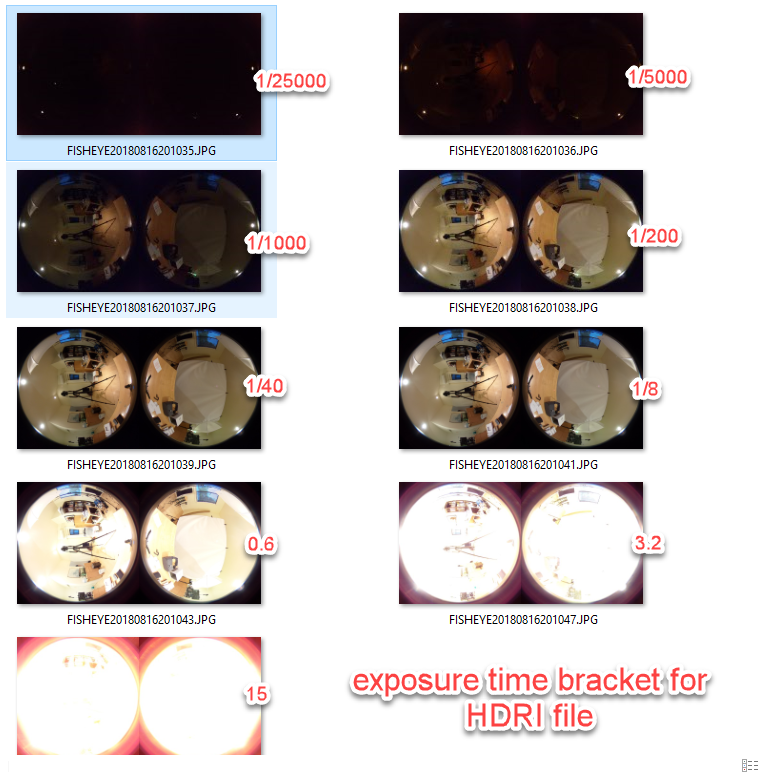
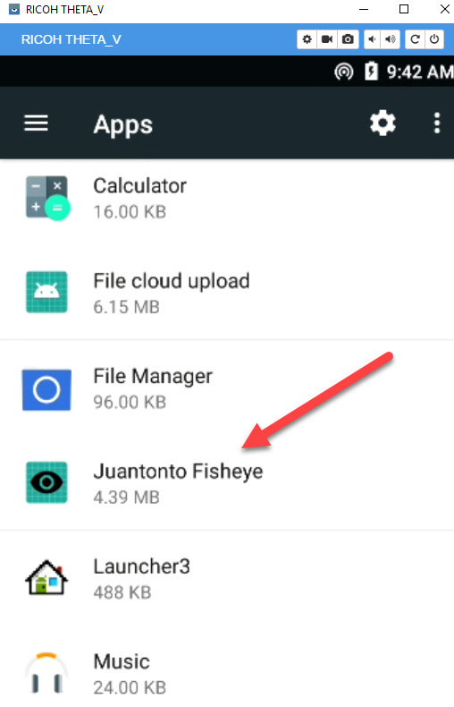
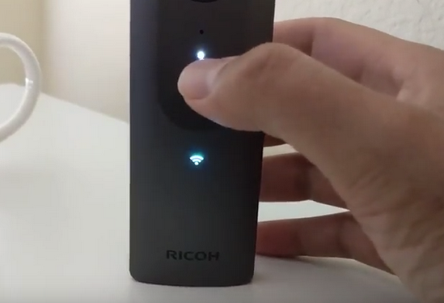
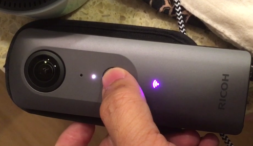

# Dual-Fisheye For THETA V - 9 Image Bracket Shutter Speed Modification

Please see the master branch for more information.

The original plug-in used exposure compensation.
This version uses shutter speed to achieve a wider range, from 1/25000 to
15 seconds. The THETA V can be hold the shutter open for 60 seconds. I have 
it set to 15 seconds to make testing easier.

RICOH Camera API for plug-in API for exposure compensation is available at:
https://api.ricoh/docs/theta-plugin-reference/camera-api/

The Ricoh Plug-in SDK is available at:
https://github.com/ricohapi/theta-plugin-sdk

## Usage Notes

The plug-in is called *Plugin Application*

You must set permissions. Documentation includes information on using Vysor.

In single image mode, the Wi-Fi LED will be cyan.

In 3 image mode, the LED will be magenta.

Switch between the modes by briefly pressing the Wi-Fi button on the side
of the camera.

Discussion
https://community.theta360.guide/t/dual-fisheye-images-with-theta-v-plug-in/2692/