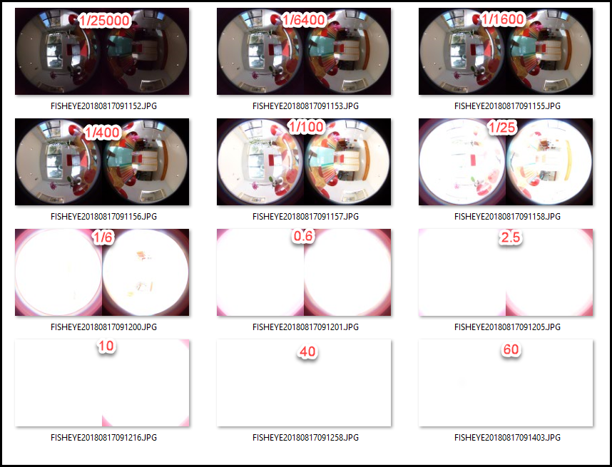
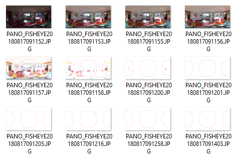
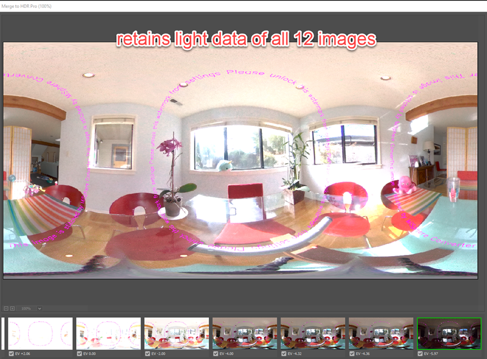
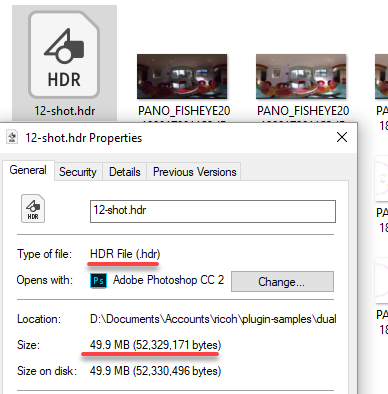

# Dual-Fisheye For THETA V - Bracket Shutter Speed Modification

Please see the master branch for more information.

## 12 Image Bracket Shooting

Using dual-fisheye plug-in to reduce shot time. There is a 
delay of approximately 1 second
between shots. 12 bracket shooting shows full range of shutter speed from
1/25000 to 60 seconds.

The original plug-in used exposure compensation.
This version uses shutter speed to achieve a wider exposure range.

You can switch this to 9 image bracket shooting or adjust the time spacing
between brackets in the code.

## Multi-Bracket On by Default

The plug-in will boot to multi-bracket mode by default. The original plug-in
started in single-shot mode.

## Post-Shoot Processing

Batch processed all images after the shoot to convert from dual-fisheye to
equirectangular.

## Create HDR File in Photoshop

Using HDR Pro.

## Save as Radiance HDR Format File

File size will increase from 5.35 MB to 49.9 MB due to luminosity information on
all images.

RICOH Camera API for plug-in API for exposure compensation is available at:
https://api.ricoh/docs/theta-plugin-reference/camera-api/

The Ricoh Plug-in SDK is available at:
https://github.com/ricohapi/theta-plugin-sdk

## Usage Notes

The plug-in is called *Plugin Application*

You must set permissions. Documentation includes information on using Vysor.

In single image mode, the Wi-Fi LED will be cyan.

In multi-shot image mode, the LED will be magenta.

Switch between the modes by briefly pressing the Wi-Fi button on the side
of the camera.

Discussion
https://community.theta360.guide/t/dual-fisheye-images-with-theta-v-plug-in/2692/